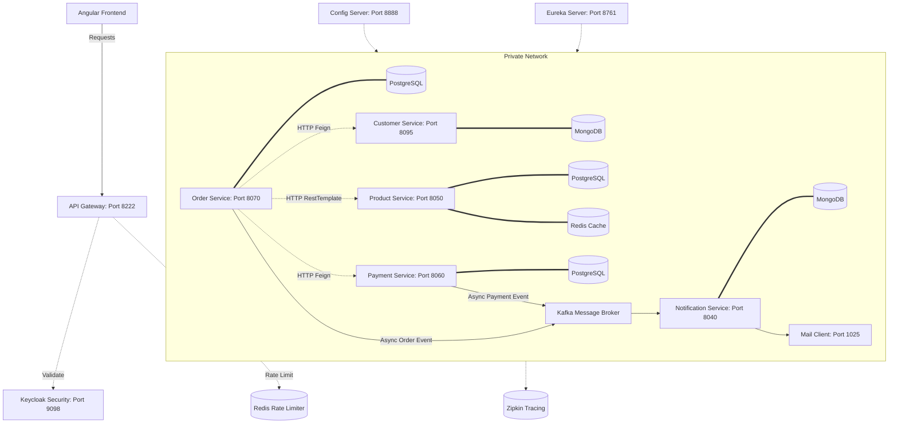

# E-Commerce Microservices Platform

An enterprise-grade, event-driven e-commerce microservices platform built on Spring Boot 3.2, Spring Cloud 2023, and Docker. The platform demonstrates key architectural patterns including centralized security (OAuth2/JWT with Keycloak), rate limiting, caching, local ACID transaction boundaries, distributed tracing, and eventual consistency via Apache Kafka.

---

## 1. System Architecture

Below is the high-level system architecture of the microservices ecosystem. It illustrates client ingress, gateway security routing, inter-service HTTP communication, and asynchronous event streams.



---

## 2. Service Catalog

### Core Infrastructure
* **Discovery Server (Eureka)**: Port `8761`. Handles service registration and discovery dynamically.
* **Config Server**: Port `8888`. Provides centralized configuration profiles fetched from a classpath configuration repo.
* **API Gateway**: Port `8222`. Secure reverse proxy that handles incoming traffic, route redirection, and OAuth2 JWT authentication validation.

### Business Microservices
* **Customer Service**: Port `8095`. Manages customer profiles. Backed by MongoDB. Uses custom indexing on `email` for \(O(1)\) lookups.
* **Product Service**: Port `8050`. Handles product catalog and purchase stock reservation. Backed by PostgreSQL (schema managed via Flyway). Uses Redis caching (Cache-Aside pattern) for product lookups.
* **Order Service**: Port `8070`. Orchestrates order placing flow. Performs synchronous downstream calls to Customer, Product, and Payment services. Backed by PostgreSQL.
* **Payment Service**: Port `8060`. Registers payments and triggers asynchronous notification events. Backed by PostgreSQL.
* **Notification Service**: Port `8040`. Consumes asynchronous messages from Kafka and dispatches automated emails (rendered SMTP emails visible in MailDev). Backed by MongoDB.

---

## 3. Architecture & Design Patterns

### Centralized Security & Downstream Propagation
* **Keycloak Authorization**: The API Gateway secures all public routes by validating JWT tokens against Keycloak (`/eureka/**` excluded).
* **Token Propagation**: Inter-service communication via Feign and RestTemplate in `order-service` uses custom request interceptors to automatically forward the client's `Authorization: Bearer <token>` header downstream.

### Local ACID Transaction Enforcements
* Relational database state operations are wrapped inside Spring `@Transactional` boundaries at the service layer (e.g., `OrderService.createOrder`, `ProductService.purchaseProducts`, and `PaymentService.createPayment`) to guarantee database consistency.

### Event-Driven Communication (Eventual Consistency)
* High-volume messaging flows (notifications) are decoupled using **Apache Kafka**. Decoupling prevents slow mail sending operations from blocking core transaction threads in the `order-service` and `payment-service`.

### Distributed Tracing
* Tracing spans are automatically generated for HTTP requests and Kafka events using **Micrometer** and **Brave Zipkin**, allowing full trace inspection across service boundaries.

---

## 4. Technology Stack
* **Framework**: Spring Boot 3.2.5, Spring Cloud 2023.0.1
* **Database**: PostgreSQL (SQL), MongoDB (NoSQL), Redis (Cache & Rate Limiting)
* **Message Broker**: Apache Kafka (Zookeeper managed)
* **Identity Provider**: Keycloak 24.0.2 (OAuth2 Resource Server setup)
* **Tracing & Logging**: Micrometer Tracing, Brave, Zipkin
* **Build System**: Maven (Java 17)

---

## 5. Development Setup & Execution Order

### Prerequisites
* Docker and Docker Compose
* Java 17 SDK (ensure `JAVA_HOME` is set correctly)

### Step 1: Spin up Infrastructure
Run the following command to start PostgreSQL, MongoDB, Kafka, Redis, Keycloak, Zipkin, and MailDev containers:
```bash
docker compose up -d
```

### Step 2: Start Configuration and Discovery Server
1. Run `ConfigServerApplication` on port `8888`.
2. Run `DiscoveryApplication` on port `8761`.

### Step 3: Run the Services
Start the rest of the services in any order. They will dynamically pull configs from Config Server and register themselves with Eureka:
* Customer Service (`8095`)
* Product Service (`8050`)
* Payment Service (`8060`)
* Order Service (`8070`)
* Notification Service (`8040`)
* API Gateway (`8222`)
